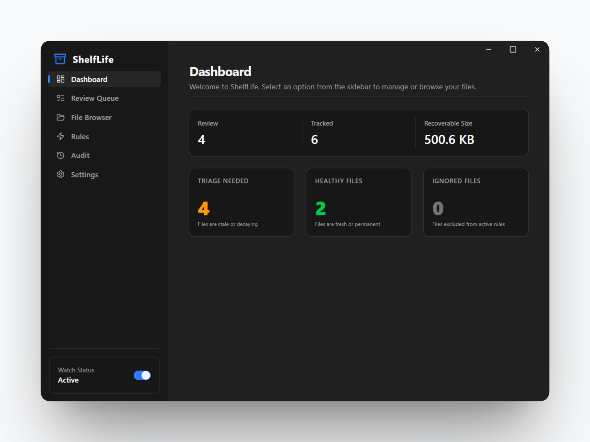
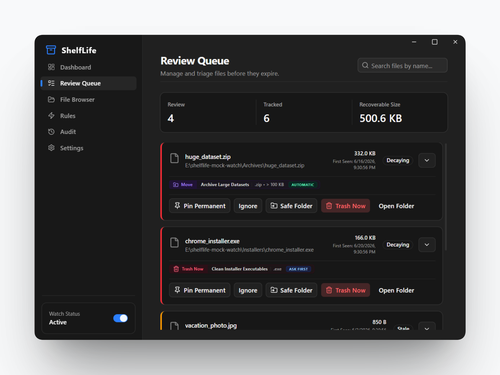
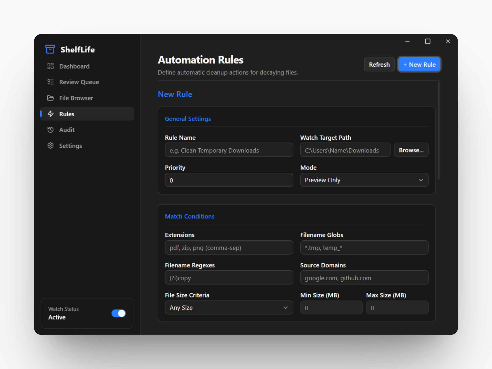
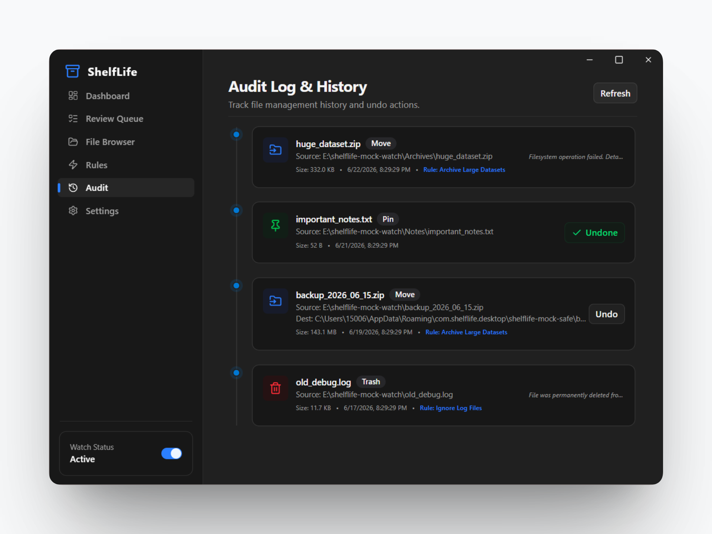

# ShelfLife

### _让文件井井有条_.

**ShelfLife** 是一款优雅、开源、轻量的桌面工具，将指定文件夹（如下载和桌面目录）视为临时中转区。文件被赋予生命周期，未固定的文件将在设定时间后自动移入回收站，帮你告别数字囤积。

 

[English](README.md) | **简体中文**

---

ShelfLife 是一款开源桌面工具，帮助你保持下载和桌面文件夹的整洁有序。它将这些目录视为临时存储区域，按你设定的时间自动将旧文件移至回收站。这种方式既能防止数字杂乱，又能让你对文件保持完全掌控。

## 设计理念

ShelfLife 以谨慎和透明为核心设计原则。它绝不会对文件做出意外或不可逆的更改。所有操作均有清晰记录，文件会被移入系统回收站，需要时可轻松恢复。这款应用就像一个贴心助手，观察、分类并根据你的指令处理文件。

## 主要功能

- **文件状态追踪：** 文件被分为清晰的状态类别：
  - **活跃期：** 最近添加或访问过的文件。
  - **闲置期：** 一段时间未被使用的文件。
  - **预警期：** 即将到达生命周期的终点。
  - **已固定：** 受到保护，永远不会被自动清理。
- **高效监控：** 利用操作系统内置的文件事件来监控文件夹，空闲时几乎不消耗系统资源。
- **可定制规则：** 创建规则来管理文件。新规则默认以安全的“预览”模式启动，让你在激活前先查看哪些文件会受到影响。
- **安全删除：** 与系统回收站集成，确保文件在必要时可以恢复。
- **下载来源识别：** 自动显示文件的下载来源，帮助你决定保留还是清理。
- **完整操作日志：** 保留超过 30 天的详细操作历史，一键撤销任何自动操作。
- **轻量高效：** 基于 Tauri 构建，运行时仅占用极少内存。

## 界面预览

<table border="0" cellpadding="0" cellspacing="0" width="100%">
  <tr>
    <td align="center" valign="top" width="50%">
      <strong>仪表板</strong>
       
       
      
    </td>
    <td align="center" valign="top" width="50%">
      <strong>清理队列</strong>
       
       
      
    </td>
  </tr>
  <tr>
    <td align="center" valign="top" width="50%">
       
       
      <strong>规则编辑器</strong>
       
       
      
    </td>
    <td align="center" valign="top" width="50%">
       
       
      <strong>操作日志</strong>
       
       
      
    </td>
  </tr>
</table>

## 许可证

ShelfLife 使用 GNU 通用公共许可证 v3.0 (GPLv3) 发布。详见 [LICENSE](./LICENSE) 文件。
